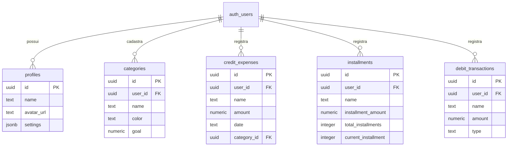

# 📊 G-TECH PLANNER — Gestão Financeira de Alta Precisão & Inteligência Artificial

O **G-TECH PLANNER** é uma plataforma completa e moderna de gestão financeira pessoal, desenvolvida em **React 18**, **Vite** e **Supabase**. O sistema oferece controle refinado sobre compras à vista, despesas parceladas em múltiplos cartões de crédito, movimentações em conta-corrente, acompanhamento de metas orçamentárias por categoria, extratos consolidados e assistente inteligente.

---

## 💡 Visão Geral do Projeto

O objetivo do **G-TECH PLANNER** é proporcionar clareza e previsibilidade sobre a saúde financeira do usuário. A aplicação calcula automaticamente os ciclos de fechamento das faturas de cartão de crédito, consolida os gastos mensais e oferece dados visuais através de gráficos e widgets de progresso de metas.

---

## 🚀 Tecnologias Utilizadas

### Frontend
- **React 18** — Biblioteca para construção de interfaces reativas e modulares.
- **Vite 5** — Build tool e servidor de desenvolvimento ultra-rápido.
- **Recharts** — Biblioteca de gráficos interativos (Pizza e Barras).
- **Lucide React & FontAwesome 6** — Ícones modernos e elegantes.
- **CSS3 Vanilla (Modular)** — Arquitetura CSS dividida por responsabilidades com suporte a variáveis HSL, tema escuro nativo e animações com curvas Bézier.

### Backend & Persistência (BaaS)
- **Supabase (PostgreSQL)** — Banco de dados relacional com Row Level Security (RLS).
- **Supabase Auth** — Autenticação segura via E-mail/Senha e OAuth Google.
- **Supabase Storage** — Armazenamento de imagens de perfil do usuário (Bucket `avatars`).

---

## ✨ Funcionalidades Principais

### 1. 📊 Visão Geral & Metas de Categorias
- **Widget de Saldo de Metas**: Visualização em tempo real do orçamento total planejado versus o valor consumido no mês.
- **Alertas Orçamentários**: Indicadores visuais quando os gastos de uma categoria ultrapassam a meta definida.
- **Gráficos Dinâmicos**: 
  - *Progresso das Metas* (Gráfico de Barras comparativo entre Gasto e Meta).
  - *Distribuição Total de Despesas* (Gráfico de Pizza dividindo Crédito, Débito e Parcelado).

### 2. 💳 Cartões de Crédito (À Vista & Parcelado)
- **Múltiplos Cartões**: Suporte a diferentes cartões com configurações individuais de dia de fechamento e vencimento da fatura.
- **Cálculo Automático de Ciclo**: Lançamentos entram automaticamente na fatura atual ou subsequente conforme a data da compra.
- **Compras à Vista**: Tabela detalhada de despesas no crédito com **paginação limitada a 7 itens por página**.
- **Compras Parceladas**: Gestão de compras parceladas indicando o número da parcela ativa no mês, parcelas restantes e valor total em aberto.

### 3. 🏦 Conta-Corrente (Débito & Pix)
- **Rendimentos / Receitas**: Lançamento de salários, transferências e rendimentos.
- **Despesas / Saídas**: Registro de pagamentos à vista via Débito, Pix ou Boleto.
- **Balancete Mensal**: Cálculo automatizado do saldo corrente do mês (Receitas − Despesas).

### 4. 📄 Extratos Mensais Consolidados
- Resumo mensal unificado reunindo todas as movimentações financeiras.
- **Insights Inteligentes**: Detecção do cartão mais utilizado e projeção do mês de quitação da última parcela ativa.

### 5. 🏷️ Gerenciador de Categorias
- Criação e personalização de categorias com cores de fundo e texto totalmente customizáveis.
- Definição de limites/metas financeiras para cada categoria de despesa.

### 6. 🤖 Assistente de Inteligência Artificial
- Painel para geração de relatórios e análises preditivas sobre o comportamento de gastos do usuário.

### 7. 👤 Perfil & Configurações
- Alteração de nome exibido, atualização de e-mail e redefinição de senha.
- Upload e gerenciamento da foto de perfil.
- Alternância entre **Modo Claro** e **Modo Escuro**.
- Opção de exclusão permanente de conta (*Zona de Perigo*).

### 8. 🎨 UX & Navegação Suavizada
- Transições de tela suavizadas (`cubic-bezier(0.16, 1, 0.3, 1)`).
- Rolagem suave ao navegar entre seções e troca de menus (`scrollTo` e `scrollIntoView`).
- Responsividade completa para dispositivos móveis com gaveta de navegação deslizante.

---

## 📂 Estrutura do Projeto

```
financial_planner/
├── assets/                  # Favicons, logotipos e ilustrações
├── css/                     # Estilos CSS modulares (Design System)
│   ├── _auth.css            # Estilos da tela de login e cadastro
│   ├── _base.css            # Reset, tipografia e scroll suave
│   ├── _components.css      # Componentes reutilizáveis (botões, badges, inputs)
│   ├── _dark-theme.css      # Regras e tokens do Tema Escuro
│   ├── _layout.css          # Sidebar, header e estrutura principal
│   ├── _modals.css          # Overlay e cards dos modais
│   ├── _responsive.css      # Media queries para mobile e tablet
│   ├── _tables.css          # Tabelas de dados e alertas
│   └── styles.css           # Arquivo principal que importa todos os módulos CSS
├── src/
│   ├── components/          # Componentes React da aplicação
│   │   ├── AI/              # Assistente de IA e relatórios
│   │   ├── AuthView.jsx     # Tela de login e registro de conta
│   │   ├── DashboardGrid.jsx# Dashboards, tabelas paginadas e gráficos
│   │   ├── Header.jsx       # Cabeçalho com seletor de mês/ano
│   │   ├── LandingPage/     # Landing page de apresentação
│   │   ├── Modals.jsx       # Modais de formulário
│   │   ├── Sidebar.jsx      # Menu lateral de navegação
│   │   └── TopCalendarBar.jsx # Barra superior de data corrente
│   ├── context/
│   │   ├── AppContext.jsx   # Estado global da aplicação e regras de negócio
│   │   └── AuthContext.jsx  # Gerenciamento de autenticação Supabase
│   ├── services/
│   │   └── supabaseClient.js# Configuração da API do Supabase
│   ├── styles/
│   │   └── global.css       # Importador CSS para a aplicação React
│   ├── App.jsx              # Componente raiz
│   └── main.jsx             # Ponto de entrada ReactDOM
├── database.sql             # Script SQL de criação do banco de dados e RLS
├── package.json             # Scripts e dependências do projeto
├── vite.config.js           # Configuração do Vite (Porta 3000)
└── README.md                # Documentação detalhada do projeto
```

---

## 🗄️ Modelo do Banco de Dados (Supabase / PostgreSQL)

Todas as tabelas do banco de dados utilizam **Row Level Security (RLS)**, garantindo a privacidade dos dados de cada usuário:



---

## ⚙️ Instalação e Execução

### 1. Clonar o Repositório
```bash
git clone <url-do-repositorio>
cd financial_planner
```

### 2. Instalar as Dependências
```bash
npm install
```

### 3. Configurar as Variáveis de Ambiente
Crie um arquivo `.env` na raiz do projeto com as credenciais do seu projeto Supabase:
```env
VITE_SUPABASE_URL=https://seu-projeto.supabase.co
VITE_SUPABASE_ANON_KEY=sua-chave-anonima-publica
```

### 4. Executar em Modo de Desenvolvimento
```bash
npm run dev
```
Acesse o aplicativo em **[http://localhost:3000](http://localhost:3000)**.

---

## 📄 Licença

Este projeto é privado e desenvolvido para gestão financeira pessoal de alta precisão.
